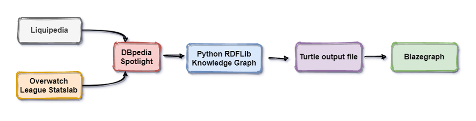

# INFO216: Group Project - Spring 2021
## <i>A Knowledge Graph for professional E-Sports</i>

This repository contains code and other resources for a group project in the course [INFO216](https://www.uib.no/emne/INFO216): Knowledge Graphs at the University of Bergen.
The project group consists of three UiB students: [Jonatan Berg Romundgard](https://github.com/Jonnashell), [Ole Einar Markeset](https://www.linkedin.com/in/ole-einar-m-6ab735120/) and [Sebastian Einar Røkholt](https://github.com/SebastianRokholt). <br>

For an explanation of what the project is about and our methodology, read the full report [here](https://github.com/Jonnashell/info216-groupproject/blob/master/E-sports%20Knowledge%20Graph%20Project%20Report.pdf).





## Quick start

### Prerequisites

- Python 3.7+
- [Blazegraph](https://github.com/blazegraph/database/wiki/Main_Page)
- Data from [Overwatch Statslab](https://overwatchleague.com/en-us/statslab) *(this repository includes these files)*

### Installation
```
pip install -r requirements.txt
```
or
```
pip install rdflib pandas requests owlrl pyspotlight
```

### Run the code

- Build graph.ttl
```
python -i main.py
```

- Run SPARQL queries (make sure you are in the same directory as your `blazegraph.jar` file)
```
java -server -jar blazegraph.jar
```
- Go to http://127.0.0.1:9999/blazegraph/ or whichever URL was provided when running the command above
